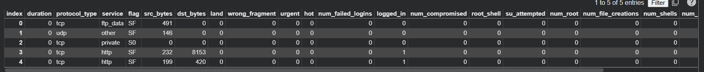
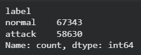
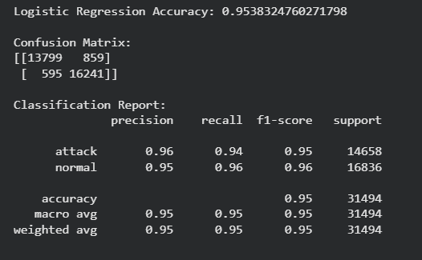
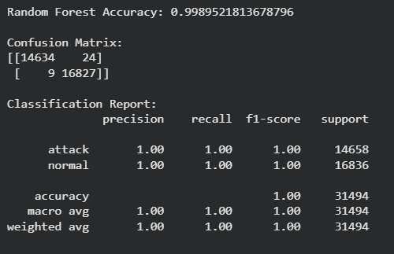
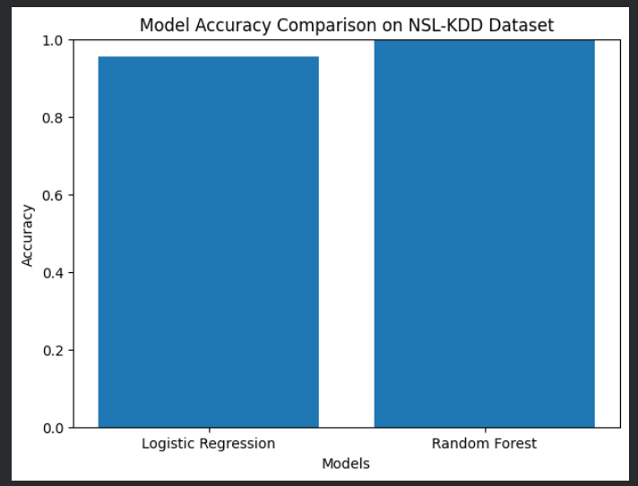
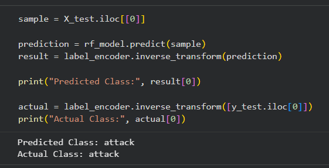

# AI-Based Network Intrusion Detection System using NSL-KDD Dataset

## Overview

This project is a machine learning-based Network Intrusion Detection System that classifies network traffic as either **normal** or **attack** using the NSL-KDD dataset.

The main goal of this project is to detect suspicious network activity using traffic-related features such as protocol type, service, flag, source bytes, destination bytes, connection count, error rates, and host-based traffic statistics.

This project is useful for understanding how Artificial Intelligence and Machine Learning can be applied in the field of networking and cybersecurity.

## Features

- Uses the real NSL-KDD dataset for network intrusion detection
- Classifies network traffic into two categories:
  - Normal
  - Attack
- Converts multi-class attack labels into binary labels
- Performs categorical feature encoding
- Splits data into training and testing sets
- Trains machine learning models
- Compares Logistic Regression and Random Forest classifiers
- Evaluates models using:
  - Accuracy
  - Confusion Matrix
  - Precision
  - Recall
  - F1-score
- Predicts whether a given network traffic sample is normal or attack

## Technologies Used

- Python
- Pandas
- NumPy
- Scikit-learn
- Matplotlib
- Google Colab
- Machine Learning

## Dataset Used

The project uses the **NSL-KDD dataset**, which is commonly used for network intrusion detection research and practice.

The dataset contains network traffic records with different features such as:

- Duration
- Protocol type
- Service
- Flag
- Source bytes
- Destination bytes
- Count
- Same service rate
- Error rates
- Host-based traffic features
- Label

The original labels contain multiple attack types such as `neptune`, `smurf`, `ipsweep`, etc.  
For this project, they are converted into binary classes:

```text
normal → normal
all other attack types → attack
```

## Project Workflow

1. Import required Python libraries
2. Load the NSL-KDD dataset
3. Add column names to the dataset
4. Explore dataset shape and label distribution
5. Convert labels into binary classes: normal and attack
6. Encode categorical columns such as protocol type, service, and flag
7. Split the dataset into features and target variable
8. Perform train-test split
9. Apply feature scaling for Logistic Regression
10. Train Logistic Regression model
11. Train Random Forest model
12. Evaluate model performance
13. Compare model accuracy
14. Test prediction on a sample network record

## Machine Learning Models Used

### 1. Logistic Regression

Logistic Regression was used as a baseline classification model.  
It performed well and achieved around **95% accuracy**.

### 2. Random Forest Classifier

Random Forest was used because it can handle non-linear patterns and complex relationships between features.  
It performed better than Logistic Regression and achieved very high accuracy on the test split.

## Results

### Logistic Regression

- Accuracy: Around 95%
- Good precision and recall for both normal and attack classes

### Random Forest

- Accuracy: 99%+
- High precision, recall, and F1-score
- Better performance compared to Logistic Regression

## Sample Output

```text
Logistic Regression Accuracy: 0.9538

Random Forest Accuracy: 0.9989

Predicted Class: attack
Actual Class: attack
```

## Screenshots

### Dataset Preview



### Label Distribution



### Logistic Regression Output



### Random Forest Output



### Model Accuracy Comparison



### Prediction Output



## Project Structure

```text
AI-Network-Intrusion-Detection/
├── AI_Network_Intrusion_Detection.ipynb
├── README.md
├── dataset_preview.png
├── label_count.png
├── logistic_regression_output.png
├── random_forest_output.png
├── accuracy_comparison.png
└── prediction_output.png
```

## How to Run

1. Open the notebook in Google Colab.
2. Upload the NSL-KDD dataset file.
3. Run all notebook cells step by step.
4. View model accuracy, confusion matrix, classification report, and prediction output.

## Resume Description

**AI-Based Network Intrusion Detection System using NSL-KDD Dataset**

- Developed a machine learning-based intrusion detection system to classify network traffic as normal or attack.
- Preprocessed the NSL-KDD dataset by encoding categorical features and converting attack labels into binary classes.
- Implemented Logistic Regression and Random Forest classifiers using Scikit-learn.
- Evaluated model performance using accuracy, confusion matrix, precision, recall, and F1-score, achieving 95%+ accuracy.

## Future Improvements

- Use the separate NSL-KDD test dataset for external validation
- Try more models such as Decision Tree, XGBoost, and SVM
- Add feature importance visualization
- Build a simple web interface for prediction
- Save and load the trained model using Pickle
- Detect specific attack categories instead of only binary classification

## Conclusion

This project demonstrates how machine learning can be used for network intrusion detection. It combines networking, cybersecurity, and AI concepts by training classification models on the NSL-KDD dataset to detect normal and suspicious network traffic.
